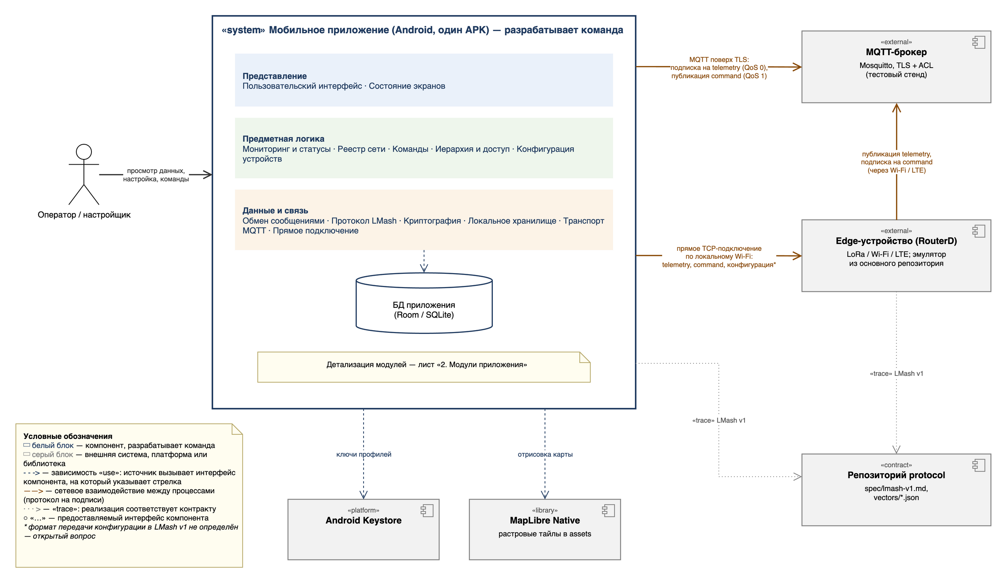
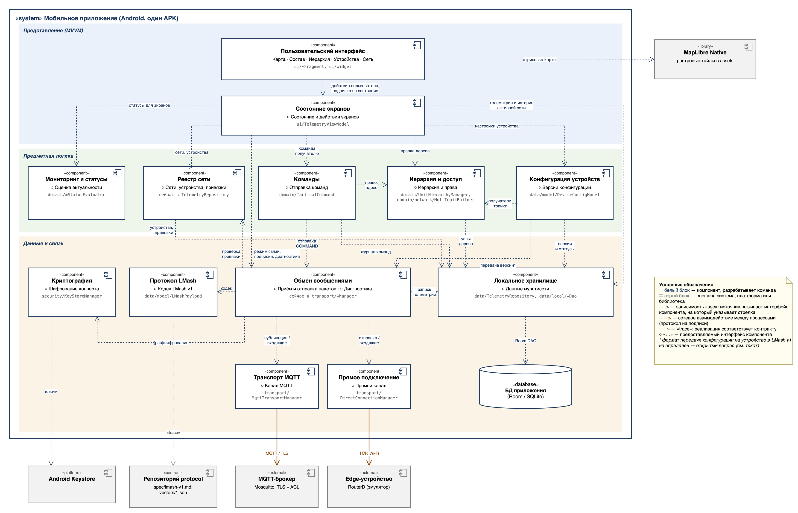

# Архитектура проекта

Документ описывает устройство мобильного приложения распределённой системы мониторинга: из каких модулей оно состоит, как они взаимодействуют между собой и с внешними системами, какие технологии выбраны и почему.

Основание — материалы лабораторной № 2 общей системы: [пользовательские истории и MVP](<https://github.com/Myakita/mobile-embedded-system/blob/main/docs/User stories и MVP.md>), [требования к MVP](<https://github.com/Myakita/mobile-embedded-system/blob/main/docs/Требования к MVP.md>) и [спецификация протокола LMash v1](https://github.com/Myakita/mobile-embedded-system-protocol/blob/main/spec/lmash-v1.md). Из них взята только мобильная часть: edge-устройства, MQTT-брокер и сборка Linux-образа для этой команды — внешние компоненты.

Описана **целевая архитектура первой версии MVP** (ориентир — начало декабря 2026 года). Текущий код приложения ей в основном соответствует; места, где он пока расходится со схемой, перечислены в разделе 6.

## 1. Общий подход и обоснование

### 1.1. Тип архитектуры

Приложение — **одно Android-приложение (один APK), внутри которого модули разделены на три слоя**: представление, предметная логика, данные и связь. Это модульный монолит со слоёной структурой. Слой представления построен по схеме MVVM: экраны наблюдают за состоянием, которое хранит ViewModel, и передают ей действия пользователя.

Зависимости направлены сверху вниз. Экран знает о состоянии экранов, состояние — о модулях предметной логики, а те — о хранилище и обмене сообщениями. Нижние слои ничего не знают об экранах и сообщают о новых данных через наблюдаемые запросы к хранилищу.

С внешним миром приложение работает как клиент по двум каналам:

- **через MQTT-брокер** по схеме «публикация/подписка»: телеметрия приходит по подписке, команды публикуются в топик получателя;
- **напрямую с edge-устройством** по TCP в локальной сети Wi-Fi: этот канал нужен, когда брокер недоступен.

Прикладного сервера (backend) нет. Брокер только пересылает сообщения, а правила доступа, история телеметрии и конфигурация сети хранятся и выполняются на телефоне.

### 1.2. Где находятся взаимодействие, правила и хранение

| Что | Где в системе |
|---|---|
| Пользовательское взаимодействие | Слой «Представление»: модуль «Пользовательский интерфейс» (пять вкладок: Карта, Состав, Иерархия, Устройства, Сеть) и модуль «Состояние экранов». |
| Основные правила | Слой «Предметная логика»: актуальность позиции и состояние устройства, учёт сетей и привязок, иерархия и права на команды, формирование команд, версии конфигурации. Правила приёма пакета (расшифрование, проверка версии и TTL, дедупликация, проверка привязки) — в модуле «Обмен сообщениями». |
| Хранение | Модуль «Локальное хранилище» и БД Room (SQLite) в песочнице приложения. Секретные ключи — в Android Keystore. |
| Работает совместно в одном приложении | Все 13 модулей на схеме: один процесс, один выпуск. |
| Отдельные приложения и внешние системы | MQTT-брокер (Mosquitto с TLS и ACL на тестовом стенде), edge-устройства (RouterD; для разработки — эмулятор из основного репозитория), репозиторий `protocol` с контрактом сообщений, Android Keystore, библиотека MapLibre Native. |

### 1.3. Почему это устройство подходит проекту

- **Работа без сервера и без Интернета — требование MVP.** Прикладной backend исключён из MVP (ЛР № 2, §6). Оператор должен видеть данные при недоступном брокере (US-11) и не терять настройки после перезапуска (US-14). Поэтому правила, история и конфигурация должны работать на самом телефоне; выносить их в отдельный сервис некуда.
- **Один выпуск достаточен.** Все модули меняются и поставляются вместе в одном APK. Независимый выпуск частей не нужен, а разбиение на несколько процессов на телефоне добавило бы межпроцессное взаимодействие без пользы для сценариев MVP.
- **Слои и MVVM — стандартная схема Android Jetpack.** ViewModel сохраняет состояние при смене конфигурации экрана (поворот, переключение дневной и ночной темы), а подписки LiveData снимаются вместе с жизненным циклом экрана. Команде не нужно писать собственный каркас, а новый участник узнаёт знакомую структуру.
- **Правила проверяются без эмулятора.** Предметная логика и протокол — обычные Java-классы без зависимостей от Android. Они тестируются на JVM командой `./gradlew test`; сейчас в проекте 24 тестовых класса. DevOps может запускать эти проверки в CI на каждом изменении, не поднимая Android-эмулятор.
- **Границы модулей совпадают с распределением работы.** Аналитик и Product Owner согласуют экраны и сценарии, не затрагивая правила. Разработчик реализует транспорт и логику за согласованными интерфейсами, тимлид контролирует эти интерфейсы на ревью. Формат сообщений меняется только через отдельный репозиторий `protocol`, согласованно с embedded-частью.
- **Срок.** К началу декабря нужна одна работоспособная версия. Монолит без сетевых границ внутри быстрее собрать, отлаживать и проверять на одном устройстве.

### 1.4. Ограничения и компромиссы

- **Нет синхронизации между приложениями.** Конфигурацию мультисети ведёт один назначенный клиент (как решено в ЛР № 2). История телеметрии есть только на том телефоне, который её принял.
- **Проверка прав в приложении — не граница безопасности.** Приложение не даёт оператору отправить недопустимую команду, но настоящую защиту обеспечивают ACL брокера и проверка на устройстве. ACL брокера настраивается отдельным шагом инфраструктуры.
- **Всё работает в одном процессе.** Необработанная ошибка в разборе пакета уронит всё приложение. Поэтому модуль «Обмен сообщениями» обязан отбрасывать повреждённые и неизвестные пакеты, а не пропускать исключения дальше (требование 1.73).
- **Подложка карты — фиксированный регион.** В MVP тайлы лежат в assets APK; загрузка произвольных офлайн-регионов (US-16) — после MVP.
- **Прямое подключение работает только в одной локальной сети с устройством.** Прямое подключение по LTE/IP (US-20) не входит в первую версию.
- **Фоновые потоки вместо корутин.** Код на Java, поэтому сетевые операции и запросы к БД идут через `Executor` и обратные вызовы. Разработчику нужно следить, чтобы результат попадал на экран только через LiveData в главном потоке.

### 1.5. Состав первой версии и развитие

| Группа | Функции | Модули |
|---|---|---|
| MVP, Must (к началу декабря) | Мультисети и переключение (US-01); пользователи, устройства и привязка с проверкой конфликта (US-02); иерархия и пересчёт правил обмена (US-03); настройка устройства со статусом применения (US-04); список, карточка и карта с состояниями CURRENT / STALE / UNKNOWN (US-06, US-07); команда CHECK_IN со статусом отправки (US-08); MQTT через Wi-Fi и LTE с восстановлением подписок (US-09); дедупликация (US-10); прямое подключение по Wi-Fi (US-11); профиль AES-128-GCM (US-12); изоляция сетей (US-13); сохранение после перезапуска (US-14) | Все модули схемы |
| MVP, Should | История за выбранный период (US-15), офлайн-регион карты (US-16), подробная диагностика (US-17) | Локальное хранилище, Пользовательский интерфейс, Обмен сообщениями |
| После MVP | Поиск и фильтры (US-18), уведомления (US-19), прямое LTE/IP (US-20), несколько алгоритмов шифрования (US-21), команды HOLD и RETURN (US-22), загрузка офлайн-регионов карты | Существующие модули, новых не требуется |
| Уже есть в коде сверх MVP | HOLD и RETURN; AES-256-GCM и ChaCha20-Poly1305; экспорт трека в GPX и KML; кольца дальности, центр группы и целеуказание на карте; тревоги по пульсу и температуре | Команды, Криптография, Мониторинг и статусы, Пользовательский интерфейс |

Функции «сверх MVP» реализованы за теми же интерфейсами модулей, поэтому архитектуру они не меняют. В приёмку первой версии они не входят; скрывать ли их в интерфейсе первой версии, решает Product Owner.

Имитатор телеметрии (`data/MockTelemetryGenerator`) — не модуль продукта, а демонстрационный режим. Он генерирует данные трёх условных участников и пишет их прямо в хранилище, минуя «Обмен сообщениями». Для приёмки используется эмулятор edge-устройства со стенда основного репозитория.

## 2. Схема архитектуры

Нотация — UML, диаграмма компонентов. Исходник: [`docs/architecture/architecture.drawio`](architecture/architecture.drawio), открывается в [draw.io](https://www.drawio.com/) (desktop-приложение или app.diagrams.net). В файле два листа. PNG ниже экспортированы с опцией «Include a copy of my diagram»: каждый из них тоже открывается в draw.io для редактирования своего листа.

**Лист 1 — контекст и границы.** Что разрабатывает команда (рамка «system») и с какими внешними системами приложение обменивается данными.

**Лист 2 — модули приложения.** Все модули по слоям, их предоставляемые интерфейсы и зависимости.

Обозначения:

- белый блок со значком компонента — модуль, который разрабатывает команда; серый — внешняя система, платформа или библиотека;
- строка «○ …» внутри блока — интерфейс, который модуль предоставляет другим;
- пунктирная стрелка «use» — зависимость: модуль-источник вызывает интерфейс модуля, на который указывает стрелка. Данные при этом могут идти в обе стороны: запрос идёт по стрелке, результат возвращается обратно;
- сплошная коричневая стрелка — сетевое взаимодействие между процессами, протокол подписан на стрелке;
- точечная серая стрелка «trace» — реализация соответствует внешнему контракту (спецификации и тестовым векторам);
- строка моноширинным шрифтом — где модуль находится в коде (`app/src/main/java/com/example/mobile_embedded_system/…`).

## 3. Модули и их функции

### 3.1. Пользовательский интерфейс

- **Назначение:** экраны приложения и ввод оператора.
- **Функции:** пять вкладок нижней навигации — Карта (маркеры участников с поворотом по направлению, давность и качество позиции, трек), Состав (список и карточка участника, выбор команды), Иерархия (дерево подразделений), Устройства (форма настройки устройства и статус применения), Сеть (подключение и диагностика). Подтверждение отправки команды удержанием кнопки (`HoldToConfirmButton`).
- **Границы:** ничего не решает сам — не вычисляет статусы, не проверяет права, не обращается к БД и сети. Показывает то, что даёт «Состояние экранов», и передаёт туда действия.
- **Данные:** только отображаемые: последняя телеметрия участника, список узлов, статусы, счётчики диагностики.
- **Взаимодействие:** «Состояние экранов» (действия и подписка на состояние), MapLibre Native (отрисовка карты).
- **Код:** `ui/*Fragment`, `ui/*Adapter`, `ui/widget`, `MainActivity`, `res/layout`.

### 3.2. Состояние экранов

- **Назначение:** единая точка, через которую экраны получают данные и выполняют действия.
- **Функции:** хранит активную мультисеть, выбранного участника и режим связи (MQTT, прямое подключение, демо); при переключении сети перенастраивает подписки и выборки; предоставляет экранам наблюдаемые данные (последняя телеметрия, история, состояние подключения); передаёт действия оператора в модули предметной логики.
- **Границы:** не содержит правил предметной области (они в модулях слоя ниже) и не работает с сетью и БД напрямую, кроме подписки на наблюдаемые запросы хранилища.
- **Данные:** идентификатор активной сети, выбранный участник, режим связи, состояние камеры карты.
- **Взаимодействие:** предоставляет интерфейс «Состояние и действия экранов»; вызывается «Пользовательским интерфейсом»; вызывает «Мониторинг и статусы», «Реестр сети», «Иерархию и доступ», «Команды», «Конфигурацию устройств», «Обмен сообщениями», «Локальное хранилище».
- **Код:** `ui/TelemetryViewModel`.

### 3.3. Мониторинг и статусы

- **Назначение:** правила оценки того, насколько актуальны и достоверны показанные данные.
- **Функции:** состояние позиции CURRENT / STALE / UNKNOWN по возрасту фикса (порог 30 с, в перспективе — настройка мультисети) и признаку качества; позиция (0°, 0°) и `positionQuality = 0` считаются отсутствующими; перевод `positionQuality` в «хорошее / ограниченное / низкое / недоступно»; состояние устройства ONLINE / OFFLINE по времени последнего сообщения.
- **Границы:** только чистые вычисления над уже принятыми данными: ничего не хранит, не отправляет и не рисует. Медицинских выводов не делает (ограничение ЛР № 2).
- **Данные:** запись телеметрии и текущее время на входе, статус на выходе.
- **Взаимодействие:** предоставляет интерфейс «Оценка актуальности»; вызывается «Состоянием экранов».
- **Код:** `domain/PositionStatusEvaluator`, `domain/DeviceStatusEvaluator`, `domain/TacticalStatusEvaluator`.

### 3.4. Реестр сети

- **Назначение:** учёт мультисетей, устройств и того, какое устройство за каким пользователем закреплено.
- **Функции:** создание и выбор мультисети с её MQTT-корнем; регистрация устройства по серийному номеру; отказ при повторной регистрации и при попытке молча привязать уже закреплённое устройство к другому пользователю; явное переназначение устройства; проверка, что пара «серийный номер — userId» во входящем пакете совпадает с привязкой.
- **Границы:** не знает об организационной структуре (это «Иерархия и доступ») и о способе хранения (это «Локальное хранилище»).
- **Данные:** мультисеть (идентификатор, название, MQTT-корень), устройство (серийный номер, сеть, привязанный участник, время последнего сообщения).
- **Взаимодействие:** предоставляет интерфейс «Сети, устройства, привязки»; вызывается «Состоянием экранов» и «Обменом сообщениями» (проверка привязки); сохраняет данные через «Локальное хранилище».
- **Код:** сейчас методы `registerDevice`, `reassignDevice`, `isDeviceBindingValid` в `data/TelemetryRepository`; сущности `NetworkEntity`, `DeviceEntity`.

### 3.5. Иерархия и доступ

- **Назначение:** организационная структура мультисети и права, которые из неё следуют.
- **Функции:** дерево узлов (подразделения и участники): создание, перемещение, удаление, запрет циклов; проверка, является ли получатель подчинённым отправителя; вычисление разрешённых получателей телеметрии и команд; построение MQTT-топиков по шаблону `<network_root>/<hierarchy_path>/<message_type>/to/<dst>/from/<src>` и масок подписки на поддерево.
- **Границы:** не отправляет сообщения и не хранит данные сама. Устройству передаются только идентификаторы и готовые топики, смысл уровней иерархии остаётся в приложении.
- **Данные:** узел (идентификатор, тип, родитель, userId, путь в иерархии).
- **Взаимодействие:** предоставляет интерфейс «Иерархия и права»; вызывается «Состоянием экранов», «Командами» (право и адрес получателя), «Конфигурацией устройств» (получатели и топики устройства); сохраняет дерево через «Локальное хранилище».
- **Код:** `domain/UnitHierarchyManager`, `domain/HierarchyNode`, `domain/network/MqttTopicBuilder`.

### 3.6. Команды

- **Назначение:** отправка разрешённой команды выбранному участнику и учёт её судьбы.
- **Функции:** формирование команды CHECK_IN (в MVP — запрос внеочередной телеметрии); проверка права через «Иерархию и доступ» до отправки; запись в журнал со статусом «Создано → Передано / Ошибка»; «Подтверждено» — только если придёт подтверждение от устройства.
- **Границы:** не выбирает сетевой канал и не кодирует байты — это делает «Обмен сообщениями». Показ диалога и подтверждение пользователем — в «Пользовательском интерфейсе».
- **Данные:** команда (тип, отправитель, получатель, sequence, время, статус).
- **Взаимодействие:** предоставляет интерфейс «Отправка команд»; вызывается «Состоянием экранов»; вызывает «Иерархию и доступ», «Обмен сообщениями», «Локальное хранилище».
- **Код:** `domain/TacticalCommand`, сейчас логика отправки — в методах `dispatch*Command` класса `TelemetryViewModel`; журнал — `CommandEntity`.

### 3.7. Конфигурация устройств

- **Назначение:** настройки edge-устройства и контроль того, применены ли они.
- **Функции:** набор параметров устройства (источники телеметрии и период; параметры LoRa, Wi-Fi, LTE, MQTT; userId и получатели по умолчанию); проверка допустимых значений; новая версия при каждом изменении; статусы «Ожидает применения», «Применено», «Ошибка», «Требует обновления конфигурации». «Применено» ставится только после подтверждения версии устройством.
- **Границы:** получатели и MQTT-параметры не задаются вручную, а берутся из «Иерархии и доступа». Доставкой на устройство занимается «Обмен сообщениями».
- **Данные:** версия конфигурации устройства и её статус.
- **Взаимодействие:** предоставляет интерфейс «Версии конфигурации»; вызывается «Состоянием экранов»; вызывает «Иерархию и доступ», «Обмен сообщениями», «Локальное хранилище».
- **Код:** `data/model/DeviceConfigModel`, `data/model/ConfigSyncState`, `data/local/DeviceConfigEntity`.

### 3.8. Обмен сообщениями

- **Назначение:** единый конвейер приёма и отправки пакетов, одинаковый для всех каналов.
- **Функции:** приём: снять конверт шифрования, разобрать пакет, отклонить неизвестную версию, неверную длину и исчерпанный TTL, отбросить дубль по паре `deviceSerial + sequence`, проверить привязку устройства, записать телеметрию. Отправка: закодировать и при необходимости зашифровать COMMAND, передать в доступный канал. Счётчики диагностики (принято, TELEMETRY, COMMAND, дубли, ошибки расшифрования, повреждённые пакеты).
- **Границы:** не устанавливает соединения — это транспорты. Не решает, кому можно отправлять — это «Иерархия и доступ» и «Команды».
- **Данные:** пакет в байтах, разобранный пакет, кэш недавних ключей `deviceSerial:sequence`, счётчики.
- **Взаимодействие:** предоставляет интерфейсы «Приём и отправка пакетов» и «Диагностика»; вызывается «Состоянием экранов» (режим связи, подписки, диагностика), «Командами», «Конфигурацией устройств»; вызывает «Протокол LMash», «Криптографию», «Реестр сети», «Локальное хранилище», «Транспорт MQTT», «Прямое подключение»; транспорты возвращают входящие пакеты обратным вызовом.
- **Код:** сейчас реализован дважды — в `processIncomingMessage` класса `MqttTransportManager` и в `processDirectIncomingPacket` класса `DirectConnectionManager`; счётчики — `data/model/PacketDiagnosticsModel`.

### 3.9. Протокол LMash

- **Назначение:** преобразование прикладного пакета в 54 байта и обратно по спецификации LMash v1.
- **Функции:** сериализация и разбор полей (little-endian), перевод единиц (`temperature_x100` → °C, `latitude_e7` → градусы, `heading_cdeg` → градусы), константы типов сообщений и команд.
- **Границы:** ничего не знает о каналах, шифровании и хранении. Изменение формата сначала вносится в репозиторий `protocol`, затем сюда.
- **Данные:** поля пакета из спецификации.
- **Взаимодействие:** предоставляет интерфейс «Кодек LMash v1»; вызывается «Обменом сообщениями»; соответствие проверяется векторами из репозитория `protocol`.
- **Код:** `data/model/LMashPayload`.

### 3.10. Криптография

- **Назначение:** расшифрование и шифрование полезной нагрузки по профилю ключа.
- **Функции:** профили шифрования (Key ID, алгоритм, привязка к сети или устройству); импорт и удаление ключа; AES-128-GCM в MVP; различимые ошибки UNKNOWN_KEY, DECRYPTION_FAILED, AUTHENTICATION_FAILED, UNSUPPORTED_CRYPTO.
- **Границы:** не решает, какие пакеты шифровать, и не показывает ошибки пользователю — только сообщает их «Обмену сообщениями».
- **Данные:** метаданные профилей; сами ключи — только в Android Keystore.
- **Взаимодействие:** предоставляет интерфейс «Шифрование конверта»; вызывается «Обменом сообщениями»; хранит ключи в Android Keystore.
- **Код:** `security/KeyStoreManager`, `security/CryptoProfile`, `security/CryptoErrorCode`.

### 3.11. Локальное хранилище

- **Назначение:** все сохраняемые данные мультисетей на телефоне.
- **Функции:** запись и выборки по активной сети (изоляция сетей); запись телеметрии с отбрасыванием дубля по составному ключу `(device_serial, sequence)`; история участника за период; регламентная очистка старой телеметрии; наблюдаемые запросы, по которым обновляются экраны; фоновый поток записи.
- **Границы:** только хранение и выборки. Правила (что считать дублем по смыслу, кому что разрешено) принадлежат модулям выше; хранилище обеспечивает их ограничениями БД.
- **Данные:** мультисети, участники и узлы иерархии, устройства, телеметрия, команды, конфигурации устройств.
- **Взаимодействие:** предоставляет интерфейс «Данные мультисети»; вызывается «Состоянием экранов», «Реестром сети», «Иерархией и доступом», «Командами», «Конфигурацией устройств», «Обменом сообщениями»; работает с БД приложения через DAO Room.
- **Код:** `data/TelemetryRepository`, `data/local/*Dao`, `data/local/*Entity`, `data/local/AppDatabase`.

### 3.12. Транспорт MQTT

- **Назначение:** соединение с MQTT-брокером.
- **Функции:** подключение по TLS с проверкой сертификата; автоматическое переподключение при смене Wi-Fi ↔ LTE и восстановление подписок; подписка на топики, вычисленные «Иерархией и доступом»; публикация COMMAND с QoS 1; передача входящих пакетов в «Обмен сообщениями».
- **Границы:** не разбирает содержимое пакетов и не вычисляет топики.
- **Данные:** адрес брокера, учётные данные, список подписок, состояние соединения.
- **Взаимодействие:** предоставляет интерфейс «Канал MQTT»; вызывается «Обменом сообщениями»; сетевое взаимодействие с MQTT-брокером.
- **Код:** `transport/MqttTransportManager`.

### 3.13. Прямое подключение

- **Назначение:** связь с edge-устройством без брокера, по локальному Wi-Fi.
- **Функции:** TCP-соединение с устройством (по умолчанию `192.168.4.1:9000`); чтение входящих кадров; отправка команд и конфигурации; сообщение о разрыве.
- **Границы:** как и транспорт MQTT, только канал: разбор, дедупликация и проверки — в «Обмене сообщениями».
- **Данные:** адрес устройства, состояние соединения.
- **Взаимодействие:** предоставляет интерфейс «Прямой канал»; вызывается «Обменом сообщениями»; сетевое взаимодействие с edge-устройством.
- **Код:** `transport/DirectConnectionManager`.

### 3.14. Почему функции объединены именно так

- **Правила отделены от экранов.** Дизайн экранов (дизайн-система Part D) можно менять, не трогая правила, а правила тестируются без Android. В экранах нет обращений к БД и сети, поэтому связность между слоями низкая.
- **Один конвейер приёма для всех каналов.** Правила приёма пакета не зависят от того, пришёл он через брокер или напрямую. Если держать их в каждом транспорте, два экземпляра одних и тех же правил будут расходиться, а требование «один логический пакет — одна запись» (US-10, AC-07.3) проверять придётся дважды. Поэтому транспорты отвечают только за соединение, а обработка сосредоточена в «Обмене сообщениями».
- **Протокол отдельно от обмена.** Формат пакета задаётся внешним контрактом и проверяется его векторами; при изменении формата меняется один модуль.
- **Топики — часть «Иерархии и доступа».** Топик выводится из положения участника в дереве, поэтому при изменении дерева права, получатели и топики пересчитываются в одном месте (требование 1.12).
- **Реестр отдельно от иерархии.** Привязка устройства — учёт оборудования, иерархия — организационная структура. Устройство можно переназначить, не меняя дерево, и наоборот.
- **Только хранилище знает о Room.** Остальные модули работают с данными через его интерфейс; смена схемы БД или индексов не затрагивает правила.

## 4. Связи и интерфейсы

### 4.1. Взаимодействия модулей

| Откуда → куда | Назначение связи | Способ | Общая логика |
|---|---|---|---|
| Пользовательский интерфейс → Состояние экранов | Показ данных и передача действий оператора | Внутренний вызов; подписка на LiveData | Экран подписывается на данные выбранного участника и сети и перерисовывается при изменениях. Действия (выбор сети, команда, сохранение настроек) экран передаёт как вызовы и получает результат для показа. |
| Состояние экранов → Мониторинг и статусы | Статусы для отображения | Внутренний вызов | Передаётся последняя запись телеметрии и текущее время; возвращаются состояние позиции, качество и состояние устройства, которые экран показывает рядом со значениями. |
| Состояние экранов → Реестр сети | Работа с сетями и устройствами | Внутренний вызов | Передаются создаваемая сеть, регистрируемое устройство или новая привязка. Реестр проверяет конфликт и сообщает, принято ли изменение, чтобы экран показал причину отказа. |
| Состояние экранов → Иерархия и доступ | Показ и правка дерева | Внутренний вызов | Экран запрашивает дерево активной сети и отправляет правки (добавить, переместить, удалить узел). Иерархия отклоняет циклы и пересчитывает права и топики. |
| Состояние экранов → Команды | Отправка команды выбранному участнику | Внутренний вызов | Передаются получатель и тип команды после подтверждения пользователем. Возвращается статус, который экран показывает оператору. |
| Состояние экранов → Конфигурация устройств | Изменение настроек устройства | Внутренний вызов; подписка на LiveData | Передаётся изменённый набор параметров; модуль создаёт новую версию со статусом «Ожидает применения». Экран наблюдает за статусом и показывает смену на «Применено» или «Ошибка». |
| Состояние экранов → Обмен сообщениями | Выбор режима связи и подписок, диагностика | Внутренний вызов | При переключении сети или режима передаются параметры подключения и готовые топики подписки; обратно — состояние каналов и счётчики пакетов для вкладки «Сеть». |
| Состояние экранов → Локальное хранилище | Данные для экранов | Наблюдаемый запрос (LiveData) | Запрашиваются последняя телеметрия и история участника в активной сети. При записи нового пакета запрос сам выдаёт обновлённые данные, экран перерисовывается. |
| Команды → Иерархия и доступ | Проверка права и адрес получателя | Внутренний вызов | Передаются отправитель и получатель. Если получатель не подчинён отправителю, команда не создаётся; иначе возвращается адрес (топик) получателя. |
| Команды → Обмен сообщениями | Доставка команды | Внутренний вызов | Передаётся команда с адресом. Обмен кодирует её, при необходимости шифрует и отдаёт в доступные каналы; возвращает «передано» или «ошибка». |
| Команды → Локальное хранилище | Журнал команд | Внутренний вызов (фоновая запись) | Сохраняется команда и каждая смена её статуса, чтобы журнал пережил перезапуск. |
| Конфигурация устройств → Иерархия и доступ | Расчёт сетевых параметров устройства | Внутренний вызов | Для устройства запрашиваются получатель по умолчанию, разрешённые получатели и топики публикации и подписки; они входят в новую версию конфигурации. |
| Конфигурация устройств → Обмен сообщениями | Передача версии на устройство | Внутренний вызов | Версия конфигурации отправляется на устройство через прямое подключение; подтверждение версии возвращается и переводит статус в «Применено». Формат этого обмена ещё не согласован (раздел 7). |
| Конфигурация устройств → Локальное хранилище | Версии и статусы | Внутренний вызов | Сохраняются локальная версия, подтверждённая устройством версия и статус; различие между ними даёт «Требует обновления конфигурации». |
| Реестр сети → Локальное хранилище | Сети, устройства, привязки | Внутренний вызов | Реестр читает текущую привязку и сохраняет изменения; уникальность серийного номера внутри сети дополнительно обеспечивает ограничение БД. |
| Иерархия и доступ → Локальное хранилище | Сохранение дерева | Внутренний вызов (фоновая запись) | При изменении дерева узлы сохраняются; при запуске и переключении сети дерево загружается из БД. |
| Обмен сообщениями → Реестр сети | Проверка привязки входящего пакета | Внутренний вызов | Передаются сеть, серийный номер и userId из пакета. При несовпадении пакет не записывается, увеличивается счётчик ошибок привязки. |
| Обмен сообщениями → Протокол LMash | Кодирование и разбор | Внутренний вызов | Входящие 54 байта превращаются в поля пакета, исходящая команда — в байты. Ошибка разбора означает повреждённый пакет. |
| Обмен сообщениями → Криптография | Расшифрование и шифрование | Внутренний вызов | Передаются Key ID и зашифрованное тело; возвращаются открытые байты или тип ошибки. Пакет, не прошедший проверку целостности, дальше не обрабатывается. |
| Обмен сообщениями → Локальное хранилище | Запись телеметрии | Внутренний вызов (фоновая запись) | Записывается принятая телеметрия с временем приёма. Если пара `(device_serial, sequence)` уже есть, запись отклоняется и считается дублем. |
| Обмен сообщениями → Транспорт MQTT | Публикация и входящие | Внутренний вызов; обратный вызов для входящих | Обмен передаёт топик и байты для публикации; транспорт передаёт в обмен каждый входящий пакет вместе с каналом, по которому он пришёл. |
| Обмен сообщениями → Прямое подключение | Отправка и входящие | Внутренний вызов; обратный вызов для входящих | Так же, как с MQTT: команды и конфигурация уходят в сокет, входящие кадры возвращаются в обмен. |
| Транспорт MQTT → MQTT-брокер | Доставка через брокер | MQTT 3.1.1 поверх TLS | Приложение подписывается на телеметрию своего поддерева и публикует команды с QoS 1. После разрыва соединение и подписки восстанавливаются автоматически. |
| Прямое подключение → Edge-устройство | Работа без брокера | TCP по локальному Wi-Fi | Приложение открывает соединение, получает поток пакетов телеметрии, отправляет команды и конфигурацию. |
| Криптография → Android Keystore | Хранение ключей | API платформы (JCA) | Ключ импортируется в Keystore и далее используется только по псевдониму; из приложения его открытое значение не читается. |
| Локальное хранилище → БД приложения | Сохранение данных | Room DAO (SQL) | Все таблицы находятся в одной БД SQLite в песочнице приложения. |
| Пользовательский интерфейс → MapLibre Native | Отрисовка карты | API библиотеки | Экран карты передаёт стиль с локальным источником тайлов, маркеры, треки и слои; библиотека рисует карту без Интернета. |

### 4.2. Сценарий: телеметрия от устройства до маркера на карте

1. Edge-устройство публикует пакет TELEMETRY в брокер; «Транспорт MQTT» получает его по подписке и передаёт в «Обмен сообщениями». При прямом подключении тот же пакет приходит через «Прямое подключение».
2. «Обмен сообщениями» при наличии конверта вызывает «Криптографию», затем «Протокол LMash». Пакет с неизвестной версией, неверной длиной, исчерпанным TTL или ошибкой целостности отбрасывается с увеличением счётчика.
3. Повтор с той же парой `deviceSerial + sequence` отбрасывается — неважно, пришёл первый экземпляр через брокер или напрямую. «Реестр сети» проверяет привязку устройства к пользователю.
4. «Локальное хранилище» записывает телеметрию в активную сеть. Наблюдаемый запрос «Состояния экранов» получает новую запись.
5. «Состояние экранов» вызывает «Мониторинг и статусы» и передаёт экрану значения и статус позиции. Карта поворачивает маркер по направлению и показывает давность. Если новых пакетов нет, статус сам переходит в STALE через 30 секунд.

### 4.3. Сценарий: отправка CHECK_IN

1. Оператор выбирает участника на вкладке «Состав» или на карте, выбирает CHECK_IN и подтверждает удержанием кнопки.
2. «Команды» проверяют через «Иерархию и доступ», что участник подчинён оператору, и получают адрес. Если права нет, команда не создаётся, и оператор видит причину.
3. Команда записывается в журнал со статусом «Создано», «Обмен сообщениями» кодирует её и отдаёт в доступные каналы. Статус меняется на «Передано» или «Ошибка»; подтверждение транспорта не выдаётся за выполнение команды устройством.
4. Результат команды для MVP — внеочередная телеметрия адресата; она приходит обычным путём из сценария 4.2.

### 4.4. Потоки выполнения

Сетевые операции выполняются в фоновых потоках транспортов, запись в БД — в одном фоновом потоке хранилища, поэтому записи телеметрии не перемешиваются. На экран данные попадают только через LiveData в главном потоке. Модули предметной логики не держат своих потоков и вызываются синхронно.

## 5. Технологии и инструменты

| Технология или инструмент | Где и для чего используется | Почему подходит проекту | Существенные ограничения |
|---|---|---|---|
| Java 17 | Весь код приложения | Обязательный язык по требованиям к продукту (1.107). Android SDK и все выбранные библиотеки имеют Java API, поэтому второй язык в проекте не нужен, а код одинаково читается всеми участниками на ревью. | Нет корутин: фоновую работу приходится строить на `Executor` и обратных вызовах и вручную следить за потоками. |
| Android SDK, minSdk 26, targetSdk 37 | Платформа приложения | Обязательная платформа (1.106, 1.108). Уровень API 26 (Android 8.0) уже включает всё, что нужно приложению: Android Keystore с AES-GCM (с API 23) и TLS 1.2 для MQTT. | ChaCha20-Poly1305 в стандартной криптографии Android появляется только с API 28; для MVP это не важно, так как в первой версии используется только AES-128-GCM. |
| AndroidX Lifecycle: ViewModel, LiveData 2.8.4 | «Состояние экранов» и подписки экранов | Состояние переживает смену конфигурации, подписки снимаются вместе с экраном — нет утечек при переходах между вкладками. Room умеет отдавать результаты запросов как LiveData. | LiveData неудобна для одноразовых событий (ошибка, уведомление) — нужен отдельный механизм. ViewModel должна браться из области activity, иначе у экранов окажутся разные экземпляры. |
| Navigation Component 2.8.4, BottomNavigationView | Пять вкладок главного экрана | Требование 1.94 — быстрый доступ к основным разделам; нижняя навигация даёт его без собственной логики переключения. | Фрагменты пересоздаются при переключении вкладок; состояние, которое нужно сохранить, должно жить в «Состоянии экранов». |
| Room 2.6.1 (SQLite) | «Локальное хранилище» | Данные реляционные: сеть → участники → устройства → телеметрия. Составной первичный ключ `(device_serial, sequence)` отбрасывает дубли на уровне БД, индексы `(user_id, timestamp)` ускоряют историю, выборки по `network_id` изолируют сети. Ошибки в SQL-запросах обнаруживаются при компиляции. | Миграции схемы пишутся вручную; телеметрия растёт постоянно, поэтому нужна регламентная очистка по сроку хранения (1.92). |
| MapLibre Native Android 11.5.1 | Карта: маркеры, треки, слои | Обязательная библиотека (1.109). Открытая, не требует ключей API и позволяет задать собственный источник тайлов, в том числе локальный (`asset://`): карта работает без Интернета. | Нативная библиотека заметно увеличивает размер APK. Для загрузки офлайн-регионов нужен стиль и источник тайлов, разрешающие кэширование; в MVP — фиксированный регион в assets. |
| Eclipse Paho MQTT v3 1.2.5 | «Транспорт MQTT» | Зрелый Java-клиент MQTT 3.1.1: QoS 0 и 1 (нужны по протоколу), TLS через стандартную `SSLSocketFactory`, автоматическое переподключение при смене Wi-Fi ↔ LTE (1.44, 1.45). | Библиотека давно не развивается и не поддерживает MQTT 5. При `cleanSession = true` подписки восстанавливаются кодом приложения после каждого переподключения. В фоне Android может разорвать соединение. |
| Android Keystore и JCA (AES/GCM/NoPadding) | «Криптография» | Требование хранить ключи не в открытом виде (README §14, 1.70). Ключ, импортированный в Keystore, не извлекается обратно. AEAD-шифр одновременно шифрует и проверяет целостность — отсюда отдельная ошибка AUTHENTICATION_FAILED. | Ключ нужно доставить в приложение безопасным способом (ручной ввод или импорт). В JVM-тестах Keystore недоступен; запасной путь хранения в памяти допустим только в тестах. |
| TCP-сокеты `java.net.Socket` | «Прямое подключение» | Не требуют дополнительных библиотек; для edge-устройства TCP-сервер — самая простая сторона контракта, одинаково работающая на Raspberry Pi и в эмуляторе. | TCP передаёт поток байтов без границ сообщений: формат кадра нужно согласовать с edge-стороной (раздел 7). Работает только при прямой сетевой достижимости устройства. |
| Репозиторий `protocol` (Git submodule) | «Протокол LMash» | Один контракт для Android и embedded-части; тестовые векторы проверяют совместимость без стенда. | Любое изменение формата сначала вносится и проверяется в `protocol`, затем указатели обновляются в обоих проектах — это дольше, чем правка в одном месте. |
| Gradle Wrapper, Android Gradle Plugin 9.4.1, JUnit 4, Espresso | Сборка и тесты | Одинаковая сборка у всех участников и в CI без ручной установки Gradle; JUnit-тесты правил выполняются на JVM за секунды. | Свежая версия AGP требует актуальной Android Studio и JDK у всех участников. Espresso-тесты требуют эмулятора или устройства. |
| draw.io | Схема архитектуры | Бесплатный редактор UML, файлы хранятся в репозитории и сравниваются как текст; PNG со встроенной диаграммой открывается для редактирования. | Раскладку схемы при изменениях приходится поправлять вручную. |

## 6. Расхождения текущего кода с целевой архитектурой

Эти пункты — исходный материал для планирования в следующей лабораторной. Код в рамках этой работы не менялся.

1. **Конфигурация не доходит до устройства.** `TelemetryViewModel.saveAndTransmitDeviceConfig` только сохраняет версию со статусом «Ожидает применения». Канала передачи на устройство и подтверждения версии нет, а в LMash v1 нет подходящего типа сообщения (раздел 7, вопрос 1).
2. **Приём пакетов продублирован** в `MqttTransportManager` и `DirectConnectionManager`: два одинаковых конвейера и два независимых кэша дублей. Целевое решение — модуль «Обмен сообщениями».
3. **Реестр сети реализован внутри хранилища** (методы `TelemetryRepository`). Правила привязки нужно отделить от хранения.
4. **Карта получает собственный экземпляр ViewModel.** `MapFragment` вызывает `new ViewModelProvider(this)`, остальные экраны — `requireActivity()`. У карты оказываются свои транспорты и имитатор, и её состояние подключения расходится с вкладкой «Сеть».
5. **`TelemetryViewModel` (≈560 строк) и `MapFragment` (≈1200 строк) совмещают несколько ответственностей:** отправку команд, экспорт треков, кэш серийных номеров, слои карты. По целевой схеме отправка уходит в «Команды», а экран карты разбивается на части.
6. **Адрес брокера и путь иерархии заданы константами:** `tcp://broker.hivemq.com:1883` (публичный брокер без TLS) и `7F10/21A0`. Они должны браться из настроек мультисети и «Иерархии и доступа»; для стенда — `ssl://` с проверкой сертификата.
7. **Профили шифрования живут только в памяти**, при запуске создаются демонстрационные ключи, а при недоступном Keystore ключ хранится в памяти процесса. Метаданные профилей нужно хранить в БД, ключи — только в Keystore, демо-ключи — исключить из релизной сборки.
8. **Пароль Wi-Fi устройства хранится в `DeviceConfigEntity` открытым текстом.** Секреты конфигурации должны защищаться так же, как ключи.
9. **`LMashPayload.fromBytes` не отклоняет неизвестную версию**, а транспорты принимают пакеты длиннее 54 байт без признака конверта. Спецификация требует отклонять и то, и другое.
10. **У журнала команд нет статуса отправки** (`CommandEntity`), поэтому «Создано / Передано / Ошибка» не сохраняется.
11. **БД без миграций и с запросами в главном потоке** (`fallbackToDestructiveMigration`, `allowMainThreadQueries`): при изменении схемы локальные данные стираются. До выпуска нужны миграции.

## 7. Открытые вопросы

Эти вопросы влияют на границы модулей и интерфейсы с внешними системами. Их нужно согласовать с командой embedded-части до реализации соответствующих функций.

1. **Контракт передачи конфигурации на устройство и подтверждения версии.** LMash v1 содержит только TELEMETRY и COMMAND. Варианты: новый тип сообщения в `protocol` или отдельный локальный протокол прямого подключения. Без решения нельзя честно выставлять статус «Применено» (US-04).
2. **Формат кадра прямого подключения**: как отделяются пакеты в TCP-потоке, как выглядит конверт шифрования и как устройство проверяет, что клиент имеет право подключиться (AC-07.2).
3. **Ширина идентификаторов в MQTT-топиках.** Приложение пишет 16 шестнадцатеричных символов (`%016X`), пример в описании архитектуры общей системы — 8. Ширину нужно закрепить в спецификации `protocol`.
4. **Что считается подтверждением команды.** Для CHECK_IN естественно считать подтверждением внеочередную телеметрию адресата, но срок ожидания и связь ответа с командой нужно зафиксировать в контракте (AC-05.4).
